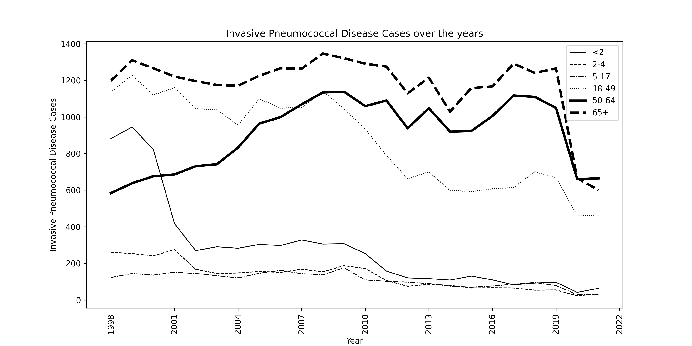

# pneumococcal

pneumo.py is for visualizing US trends of Invasive Pneumococcal Disease Cases by age.

Download the dataset file from the following CDC site and rename it to data.csv.

https://data.cdc.gov/Public-Health-Surveillance/1998-2021-Serotype-Data-for-Invasive-Pneumococcal-/qvzb-qs6p/about_data

Run the following command to visualize the trend graph.

$ python pneumo.py

